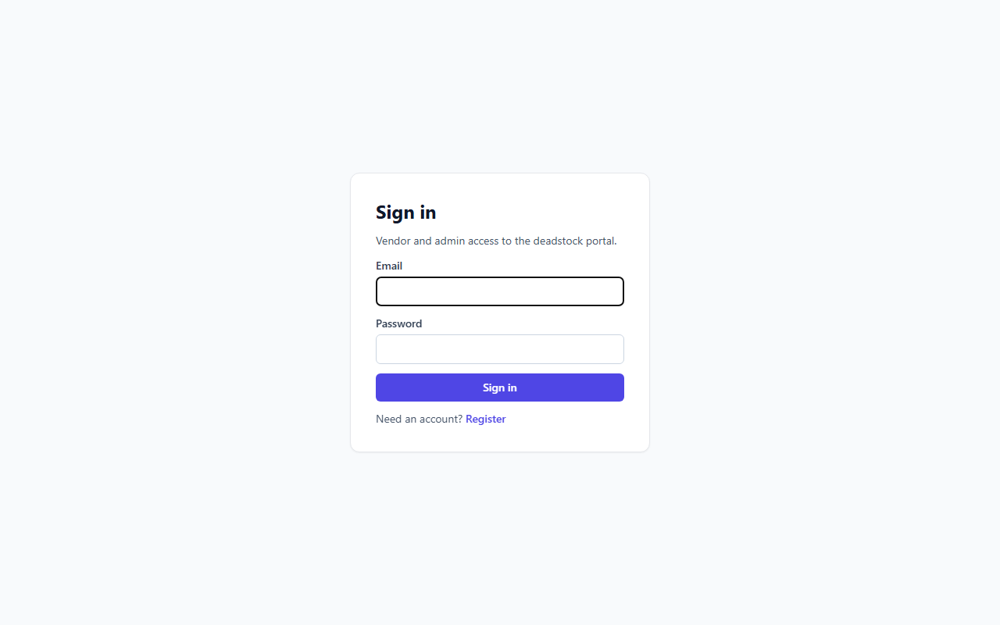
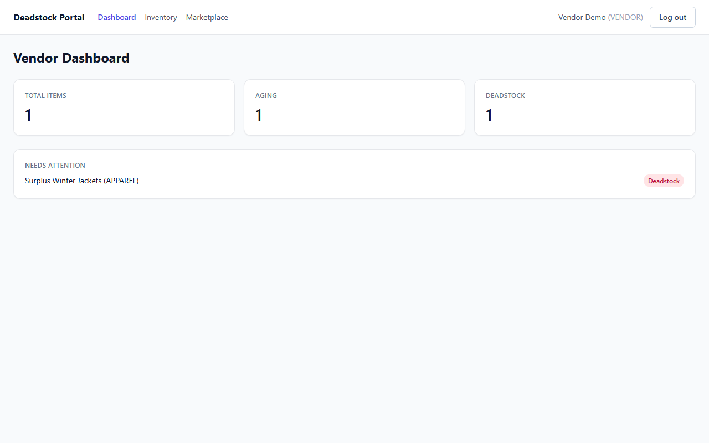
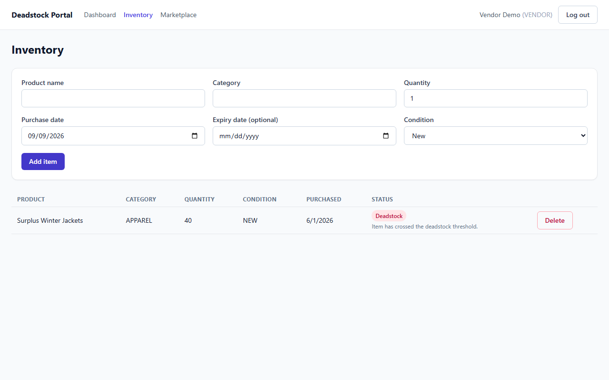
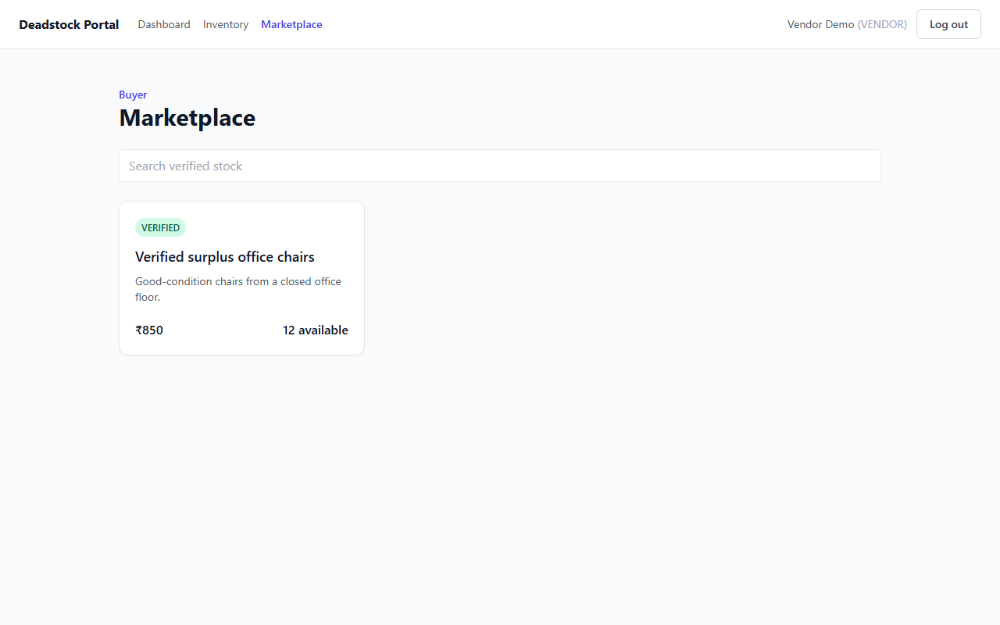

# Deadstock Frontend — Person 1 (Frontend / Vendor Experience)

React + Vite + TypeScript + Tailwind CSS, routed with React Router and backed by TanStack Query. This is the vendor-facing app shell, auth screens, vendor dashboard and inventory management for the Deadstock Management prototype, built against Aryan's (Person 2) live Express/Prisma API.

## Setup

```bash
cd frontend
npm install
cp .env.example .env   # VITE_API_BASE_URL, defaults to http://localhost:4000
npm run dev            # http://localhost:5173
npm run typecheck
npm run build
npm run test            # run once
npm run test:watch
```

The app expects the root backend (`npm run dev` from the repo root, see the root README) running and reachable at `VITE_API_BASE_URL`. Register a vendor account from `/register`, or sign in with a seeded demo account (see root README) once the backend's `npm run db:seed` has run.

## What's implemented

- **App shell & routing** (`src/App.tsx`, `src/components/layout/`): `AppLayout` (nav + session), `ProtectedRoute` (auth + role gating).
- **Auth screens** (`src/pages/LoginPage.tsx`, `RegisterPage.tsx`, `src/context/AuthContext.tsx`): call the real `POST /api/auth/register`, `POST /api/auth/login`, `GET /api/auth/me`; session (`{ user, token }`) persists in `localStorage` and is re-validated against `/api/auth/me` on load.
- **Vendor Dashboard** (`src/pages/VendorDashboardPage.tsx`): total items, aging count, deadstock count, and a "needs attention" list, all sourced from the backend's `status`/lifecycle fields — no client-side date math.
- **Inventory** (`src/pages/InventoryPage.tsx`, `src/features/inventory/`): Add Inventory form (`POST /api/inventory`) and Inventory table (`GET /api/inventory`) with delete (`DELETE /api/inventory/:id`); dashboard aging/deadstock counts use the dedicated `GET /api/inventory/aging` and `GET /api/inventory/deadstock` endpoints.
- **Status badges**: `ACTIVE` / `AGING` / `DEADSTOCK_FLAGGED` / `SUBMITTED_FOR_VERIFICATION` rendered via `StatusBadge`, driven by the backend-computed `status` field (see `src/features/inventory/status.ts` for the label/tone mapping).
- **Reusable UI components** (`src/components/ui/`): `Card`, `Button`, `TextField`, `Select`, `StatusBadge`.
- **Person 3's pages mounted**: `AdminReviewPage` (`/admin`, ADMIN-only) and `BuyerMarketplacePage` (`/marketplace`, public) from `src/features/person3/` are wired into the shared router as invited by their README note. Their internals (mock data → live API) remain Person 3's to finish.
- **Tests** (Vitest + React Testing Library): `status.test.ts` (status→label/tone mapping) and `InventoryTable.test.tsx` (renders rows/badges, empty state, disables delete for in-flight verification, delete callback).

## API contract this frontend relies on

Response envelope: `{ success: true, data }` or `{ success: false, error: { message } }`. Inventory fields are the backend's own casing (`product_name`, `purchase_date`, etc.) plus a computed `lifecycle` object — see `src/types/inventory.ts` and Aryan's `docs/person2-foundation.md` / `docs/person3-integration-contract.md` at the repo root for the frozen contract this was built against.

## Screenshots

| Login | Dashboard | Inventory | Marketplace |
|---|---|---|---|
|  |  |  |  |

Screenshots were captured against a throwaway local mock of the auth/inventory endpoints (matching the real contract shapes) since this environment has no Supabase/Postgres credentials to run the real backend; the app itself only talks to the real REST API in `src/lib/api.ts` and `src/features/*/api.ts`.
